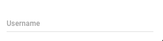

# Qt Material Design Desktop Widgets

## :hatched_chick: Update!

I finally took the time to go through and clean up this code. The build includes an executable with a preview, and some settings to play around with for each widget. A (YouTube) video preview is [available here](http://www.youtube.com/watch?v=21UMeNVBPU4).

#### Implemented components

- [x] Avatar
- [x] Badge
- [x] Check Box
- [x] Circular Progress
- [x] Dialog
- [x] Drawer
- [x] Floating Action Button
- [x] Flat Button
- [x] Icon Button
- [x] Progress
- [x] Radio Button
- [x] Raised Button
- [x] Scroll Bar
- [x] Slider
- [x] Snackbar
- [x] Tabs
- [x] Text Field
- [x] Toggle

#### Preview

| Component     | GIF           | 
| ------------- |---------------| 
| Text Field    |  | 

#### Not implemented 

- [ ] App Bar
- [ ] Autocomplete
- [ ] Chips
- [ ] Discrete Slider
- [ ] Divider
- [ ] Grid List
- [ ] Icon Menu
- [ ] List
- [ ] Menu
- [ ] Paper
- [ ] Search Field
- [ ] Select Field
- [ ] Stepper
- [ ] Table
- [ ] Toolbar
